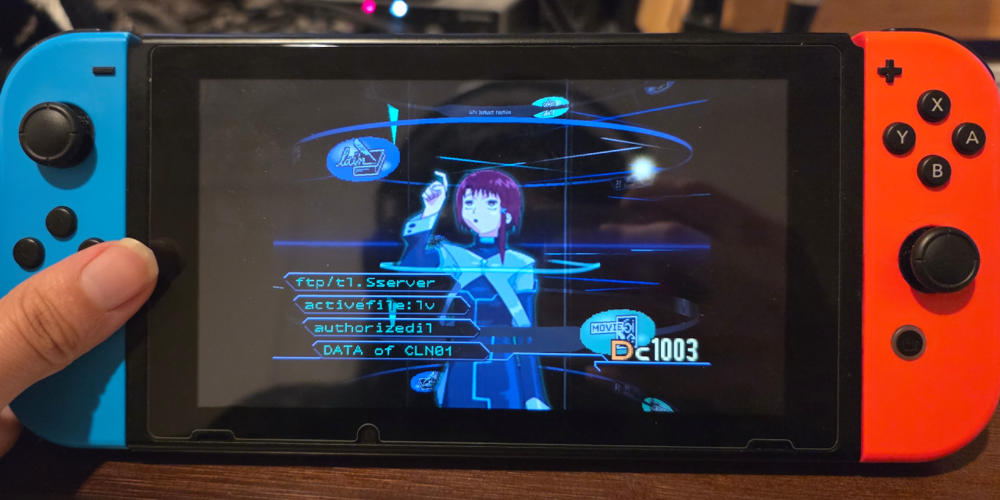

## lainNX

  

A `nx.js`-based implementation of the Serial Experiments Lain PSX game using `three.js` with the aim to provide multi-language support and run on Switch as a homebrew app.

## Installation

Since the homebrew app does not bundle any game assets itself, you will need to provide an "offline `laingame.com`" file yourself. **The `laingame.com` file is an offline version of the lainTSX web-browser port of the game and is NOT the same as the original `.bin` PS1 ROM files.** This guide will not mention whatsoever how to obtain this file for legal reasons.

1. Download the latest `lainNX_nro.zip` from [here](https://github.com/amydevs/lainNX/releases/latest/download/lainNX_nro.zip)
2. Extract `lainNX_nro.zip` to the root of your switch SD card.
3.
    - Rename `laingame.com` to `laingame.zip` and extract all folders EXCEPT `voice` inside said zip to the `switch/LainNX` folder on your Switch SD card. Refer to this [gif](screenshots/extraction.gif) for how to extract said files on Windows.
    - If you are on Windows make sure to do this using Windows Explorer, if you are on Mac please use Finder, otherwise if you are on linux please do this using the command `unzip laingame.zip -d laingame`. This is as 7Zip seems to have trouble with recognising the file as an archive.
    - If you are unable to unzip the folder, you may also place `laingame.com` inside `switch/LainNX` to let the Switch unzip it on boot, make sure that you do this while docked as the extraction process takes VERY VERY LONG on Switch.
4. Launch `LainNX` from the Homebrew launcher (make sure you're not in applet mode!).
5. On first launch, a config file will be created at `switch/LainNX/config.json` on the Switch SD card, you may edit this to change language or keybindings as you wish.

## History

The original PSX game was released in Japan, back in 1998. The game never got a proper english adaptation, which resulted in all non-Japanese speaking players either having to play through the game while simultaneously reading through the translation, or simply not playing the game at all and only reading it.

The goal of this project is to provide a better experience for those willing to play the game, and the way to do so is by implementing a subtitle system, which has the capability to support multiple languages.

## How do I contribute to the translations?
Go to https://crowdin.com/project/lain-psx

## Building locally

Since the repository doesn't host any of the game's assets, you need to provide the original binaries yourself.
By using a script we extract and format the assets necessary from the provided binaries.

Dependencies for running the script:
- Java
- FFmpeg
- ImageMagick >= 7

Instructions for running the script:
1. Inside the `scripts` folder, create `discs` folder, and put both disc binaries there under the names `disc1.bin` and `disc2.bin`.
2. Run `extract.mjs`. It also has potential flags you may want to use such as `--no-delete` and `--tempdir`.

Note that currently the extraction script doesn't extract SFX, but the game still runs fine locally.

## TODO

- **Fix crashes after trying to load videos after sleeping (`nx.js` issue)**
- **Fix audio media scene visualiser not working as audio analysis is not supported (`nx.js` upstream issue, currently polyfilled with random data)**
- **Fix emote wheel**
- **Add controls for zoom and aspect ratio**
- **Finish writing the extraction script**
- **Improve/complete the translation**

## Screenshots

  
  
  
  
  
  
  
  

## Reporting bugs and contributing

If you have any ideas/suggestions/found an issue or want to help us with the translation or anything else, please [make an issue](https://github.com/amydevs/lainNX/issues).

## Tools used during development

- [`jPSXdec`](https://github.com/m35/jpsxdec) - PlayStation 1 audio/video converter.
- [`three.js`](https://github.com/mrdoob/three.js/) - JavaScript 3D renderer.
- [`nx.js`](https://github.com/TooTallNate/nx.js) - JavaScript runtime for Switch Homebrew
